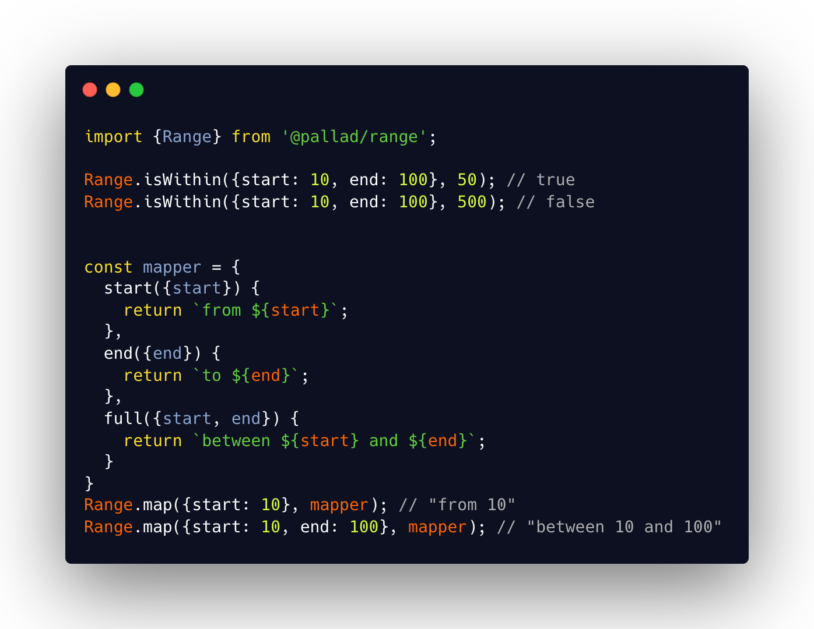

<div align="center">
<h1>Range 🎯</h1>

<p>Range structure</p>
</div>

---
[](https://circleci.com/gh/pallad-ts/range/tree/master)
[](https://badge.fury.io/js/@pallad%2Frange)
[](https://coveralls.io/github/pallad-ts/range?branch=master)
[](https://opensource.org/licenses/MIT)
---



Very simple structure with [helper methods](#helper-methods) to define range of values in following scenarios

* from A
* to A
* between A and B

# Community

Join our [discord server](https://discord.gg/G5tSBYbpej)

# Installation

```shell
npm install @pallad/range
```

# Usage

`Range` consists of 3 different interfaces

`Range.Start` that defines only a start without an end.

```typescript
interface Start<T> {
    start: T
}
```

`Range.End` that defines only an end without a start.

```typescript
interface End<T> {
    end: T;
}
```

`Range.Full` that defines both a start and an end.

```typescript
type Full<T> = Start<T> & End<T>
```

The `Range` type itself is an union of those 3 types.

```typescript
type Range<T> = Range.Full<T> | Range.Start<T> | Range.End<T>;  
```

## Creating

You can create `Range` from regular creation function, array or tuple.

Regular `create`

```typescript
// full range
Range.create(1, 100);
// start range
Range.create(1);
// end range
Range.create(undefined, 100);
```

From array or Tuple

```typescript
// start range
Range.fromArray([1])
// full range
Range.fromArray([1, 100])

// full range - other values are ignores
Range.fromArray([1, 100, 1003, 3000])
// end range
Range.fromArray([undefined, 100])

```

If creation fails, `TypeError` is thrown.

```typescript
// fails - undefined values
Range.create(undefined, null)

// fails - start greater than end
Range.create(100, 1)

// fails - empty array
Range.fromArray([])
// fails - undefined values only
Range.fromArray([undefined, null])
```

You can prevent throwing an error using `.either` property on creation functions which
returns [`Either`](https://www.npmjs.com/package/@sweet-monads/either) monad.

```typescript
Range.create(1, 100).value;
Range.create(null, undefined).value // 'Cannot create Range from undefined or null values'
```

## Enchanted range

Enchanted range is a range object with extra methods. Enchanted object is immutable.

```typescript
const enchantedRange = enchant(Range.create(1, 100));

enchantedRange.isWithin(40); // true
enchantedRange.isWithin(500); // false

enchantedRange.map({
    start: ({start}) => `from ${start}`,
    end: ({end}) => `to ${end}`,
    full: ({start, end}) => `between ${start} and ${end}`
}); // 'between 1 and 100`

enchantedRange.toTuple(); // [1, 100]
```

## Checking if value is a Range

```typescript
Range.is({start: 10}) // true
Range.is({end: 10}) // true
Range.is({start: 1, end: 10}) // true
```

# Helper methods

## Mapping

Mapping converts range to any other value.

`Range.map` accepts object with properties named `start`, `end` and `full` where each of it might be a function or any
other value.
If property value is a function then result of that function gets returned, otherwise it takes the value.

```typescript
const range = Range.create(1, 100);
// mapping to simple values
Range.map(range, {start: 'start', end: 'end', full: 'full'}) // 'full'

// mapping functions
enchantedRange.map({
    start: ({start}) => `from ${start}`,
    end: ({end}) => `to ${end}`,
    full: ({start, end}) => `between ${start} and ${end}`
}); // 'between 1 and 100`
```

## Check if value falls in range

`Range.isWithin` checks if given values falls in range. Internally uses `@pallad/compare` so custom comparison functions
for value objects are supported.

```typescript
Range.isWithin(Range.create(1, 100), 50) // true
Range.isWithin(Range.create(1, 100), 500) // false
```

### Exclusivity

By default `isWithin` treats every range as inclusive for both edges. You can change that behavior with second argument.

```typescript
const range = Range.create(1, 100);

// exclusivity = false 
Range.isWithin(range, 100, false) // true 
Range.isWithin(range, 1, false) // true

// same as above
Range.isWithin(range, 100) // true 
Range.isWithin(range, 1) // true 

// exclusivity = true 
Range.isWithin(range, 100, true) // false
Range.isWithin(range, 1, true) // false

// start exclusive 
Range.isWithin(range, 100, {start: true}) // true
Range.isWithin(range, 1, {start: true}) // false

// end exclusive 
Range.isWithin(range, 100, {end: true}) // false 
Range.isWithin(range, 1, {end: true}) // true
```
